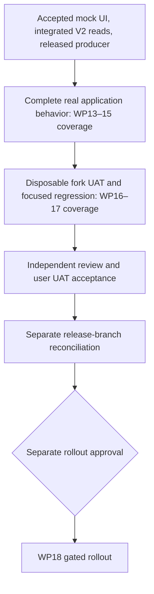

# DAO delivery dependencies

The [milestone plan](milestone-plan.md) is the single active delivery plan.
The September 23 publication acceptance closes implementation and operator UAT in the graph below.
Closeout approval, integration, separate release reconciliation, and rollout approval remain.
Historical acceptance and evidence remain in [status](status.md).

The implementation and UAT use one package. [Current closeout evidence](evidence/closeout-20260924/README.md) and the [local runbook](../local-fork-uat.md) record delivered behavior and validation.
A continuous producer and permanent fork infrastructure are unnecessary. The required released-producer checkpoint passed in the [accepted follow-up](../publication-acceptance-20260923.md).
Fixture refresh is not indexing proof, and fixture tests are not producer interoperability evidence.
Production transaction and deployment authority remain separate from local fork authorization.
