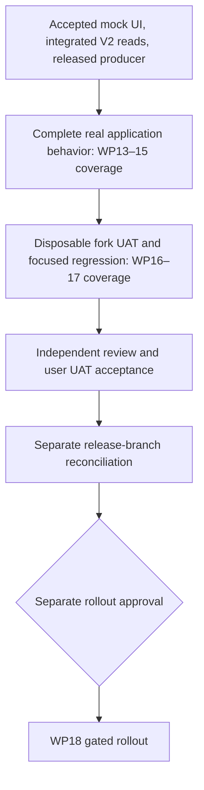

# DAO delivery dependencies

The [milestone plan](milestone-plan.md) is the single active delivery plan.
The 2026-09-10 authorization supersedes older package sequencing and producer-start gates.
Historical acceptance and evidence remain in [status](status.md).

The implementation and UAT use one package. A continuous producer and permanent fork infrastructure are unnecessary.
Producer checkpoints are optional. Fixture refresh is not indexing proof, and fixture tests are not producer interoperability evidence.
Production transaction and deployment authority remain separate from local fork authorization.
