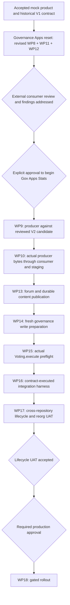

# DAO delivery dependencies after the V2 reset

The historical M0–M2 acceptance and V1 WP8 acceptance remain in [status](status.md).
The user authorized replacing the V1 freeze and the old WP10-before-WP11 dependency.

WP9 belongs to Gov Apps Stats; this reset changes Governance Apps only.
A consumer fixture is not producer interoperability evidence. Small coordinated
V2 amendments may follow real producer findings and require review.
No merge, external approval, producer start, deployment or production approval
is implied by completion of this branch.
