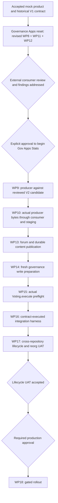

# DAO delivery dependencies after the V2 reset

The historical M0–M2 acceptance and V1 WP8 acceptance remain in [status](status.md).
The user authorized replacing the V1 freeze and the old WP10-before-WP11 dependency.

Current state (2026-09-08): consumer external review is complete, producer handoff
is approved and the exact consumer range is integrated. See the [integration
record](evidence/feed-v2/integration.md). WP9 is next in its own authorized producer
task; its preflight and all interoperability, deployment-verification, lifecycle,
staging and production gates remain pending.

WP9 belongs to Gov Apps Stats; this reset changes Governance Apps only.
A consumer fixture is not producer interoperability evidence. Small coordinated
V2 amendments may follow real producer findings and require review.
The recorded consumer approval and merge clear the consumer handoff gate.
They do not establish actual producer interoperability, live deployment
correctness, contract-executed lifecycle evidence, staging validation or
production readiness, or authorize publication, deployment or production writes.
